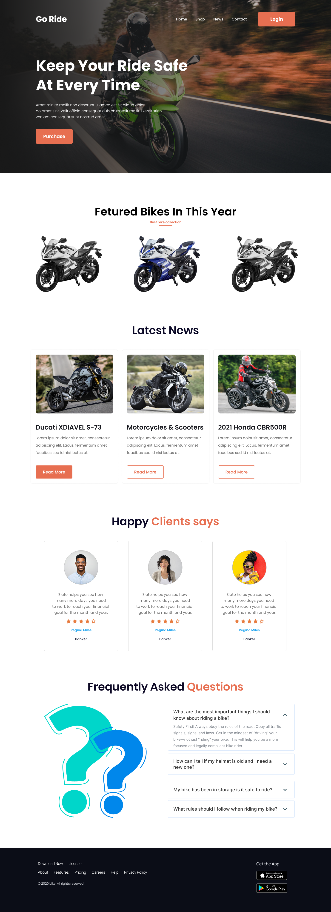

# Biker Zone

The Bootstrap CSS framework was used in this project to construct a responsive Biker Zone Landing Page. I learned how to create a responsive website without using Vanilla CSS here.

liveDemo: https://imamahasane.github.io/BikerZone/

sourceCode: https://github.com/imamahasane/BikerZone

